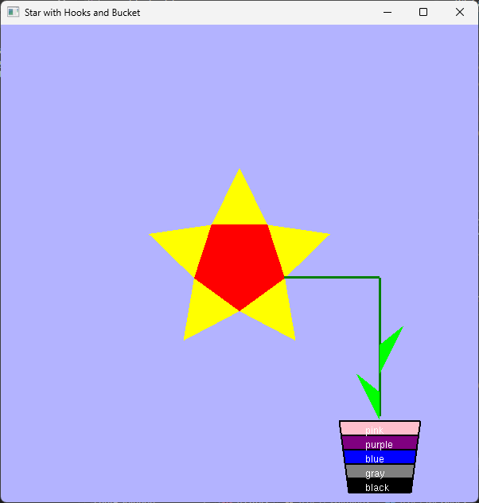

# SunFlower OpenGL Demo

This project demonstrates drawing a stylized sunflower (star with hooks and a bucket) using OpenGL and GLUT in C++.

## Features
- Draws a red pentagon at the center.
- Renders five yellow star points (triangles) around the pentagon.
- Adds green hooks and a bucket with five colored layers (black, gray, blue, purple, pink).
- Labels each bucket layer with its color name.

## Screenshot

## How to Build and Run

1. **Requirements:**
   - OpenGL and GLUT libraries (e.g., freeglut)
   - C++ compiler (Visual Studio recommended on Windows)

2. **Build:**
   - Open the solution `opengl-boilerplate.sln` in Visual Studio.
   - Build the project (ensure `freeglut.dll` and `glew32.dll` are available in the output directory).

3. **Run:**
   - Execute the generated `opengl-boilerplate.exe`.

## File Structure
- `main.cpp` — Main source code for rendering the sunflower scene.
- `Sunflower.png` — Screenshot of the rendered output.
- `opengl-boilerplate.sln` — Visual Studio solution file.
- `x64/Debug/` — Output directory with built binaries and required DLLs.

## Credits
- Developed by: Prabesh Aryal
- Date: May 14, 2025

---
